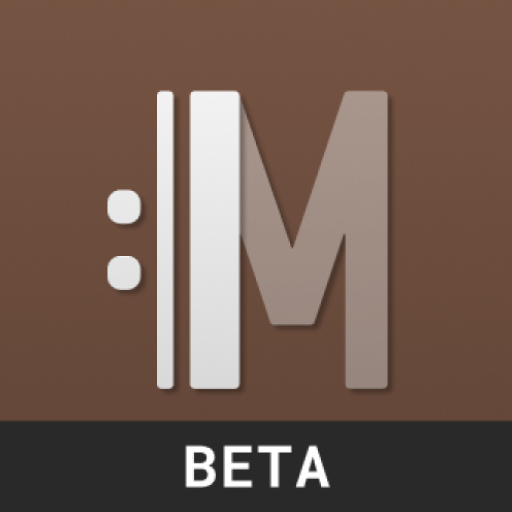

  

<h1 style="align: center;">Musikus</h1>

Your personal practice companion

## 🧪 Musikus is in alpha

### Join
If you want to join our group of testers, write us an email to [alpha@musikus.app](mailto:alpha@musikus.app) using your GMail account and we will add you to the list.

### Feedback
If you have any feedback, bug reports or feature requests, please fill out [this](https://docs.google.com/forms/d/e/1FAIpQLSfw1rTslL7b3Yp_Lv_E65zketfj7G6h5VzOkVdxjcQZDC5CqA/viewform) form or use the [Issue Tracker](https://github.com/matthiasemde/musikus-android/issues/new).

## 👨‍💻 Contributors

## 📃 License
Copyright (c) Matthias Emde
Copyright (c) Michael Prommersberger

Licensed under the Mozilla Public License, v. 2.0: https://mozilla.org/MPL/2.0/

## 🎼 Other
This project is a fork / continuation of [PracticeTime!](https://github.com/PracticeTimeApp/PracticeTime)
